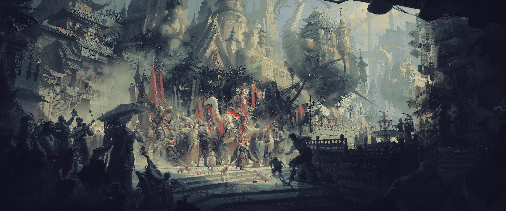
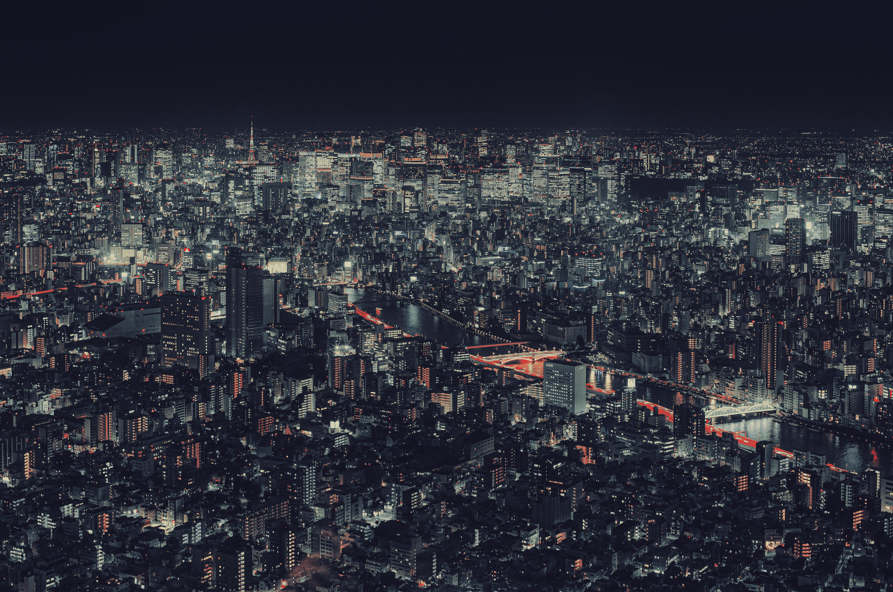
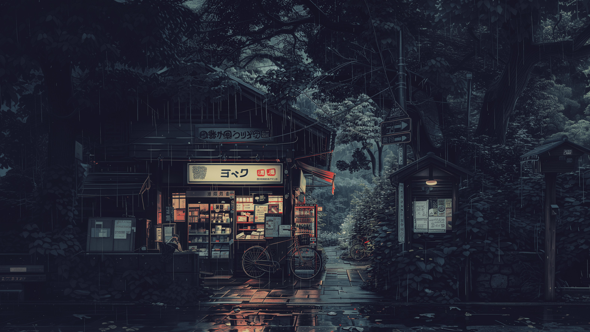

# Kanagawa Wallpapers

This is a collection of wallpapers I recolored to match the [Kanagawa colorscheme](https://github.com/rebelot/kanagawa.nvim). I use Anhno's [gowall](https://github.com/Achno/gowall?tab=readme-ov-file) to recolor the wallpapers to the Kanagawa colorscheme. `kanagawa-wave.json` is prepared for the use with gowall.

## Preview

| Column1                             | Column2                               |
| ----------------------------------- | ------------------------------------- |
|  |  |
|  |  |
|  |  |
