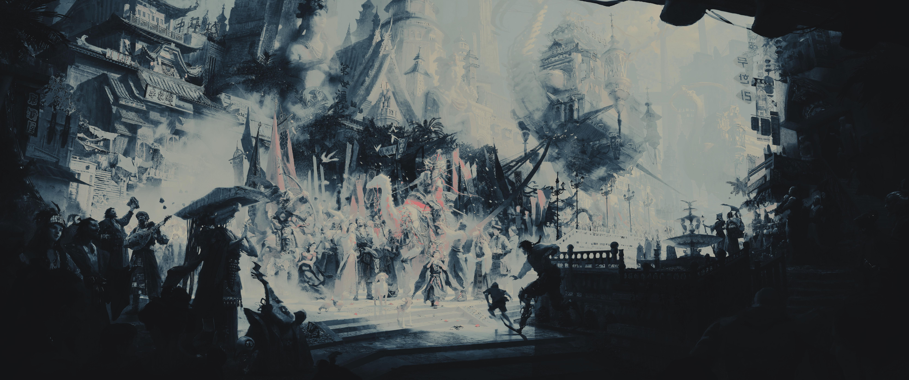
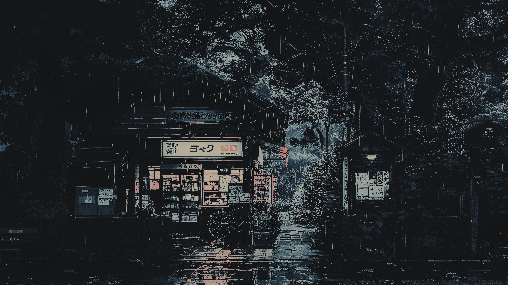

# Kanagawa Wallpapers

This is a collection of wallpapers I recolored to match the [Kanagawa colorscheme](https://github.com/rebelot/kanagawa.nvim). I use Anhno's [gowall](https://github.com/Achno/gowall?tab=readme-ov-file) to recolor the wallpapers to the Kanagawa colorscheme. `kanagawa-wave.json` is prepared for the use with gowall.

## Preview

| Kanagawa Wave                             | Kanagawa Dragon                               |
| ----------------------------------- | ------------------------------------- |
|  |  |
|  |  |
|  |  |

In order to use the flake of this repo:
```nix
{
    inputs = {
    --- snip ---
        wallpapers = {
            url = "github:FKouhai/Kanagawa-wallpapers"
        };
    --- snip ---
    };
    outputs = {
        self,
        --- snip ---
        wallpapers,
        --- snip ---
    }@ inputs;
    # then either in the flake or in your configuration.nix/home.nix set the environment.systemPackages to: wallpapers.packages.x86_64-linux.default
    # and set the wallpaper with ${wallpaper}/kanagawa-dragon/wallpaper_name
    # or set the wallpaper with ${wallpaper}/kanagawa-wave/wallpaper_type/wallpaper_name
}
```
For a better example please refer to this [flake](https://github.com/FKouhai/nix-dots/blob/main/flake.nix).
